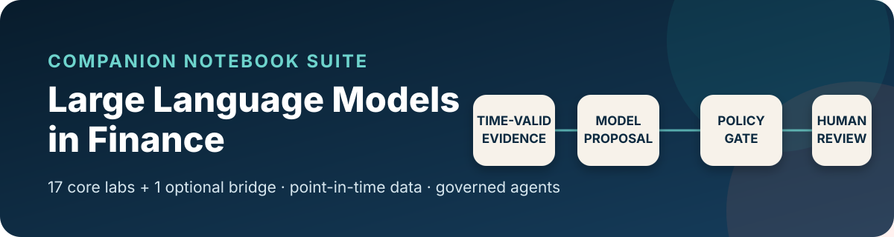
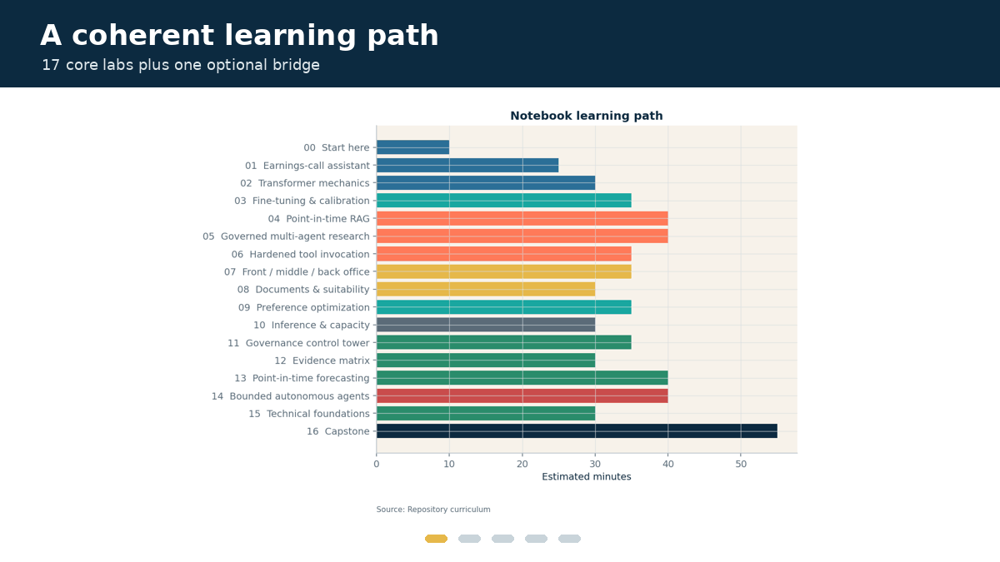
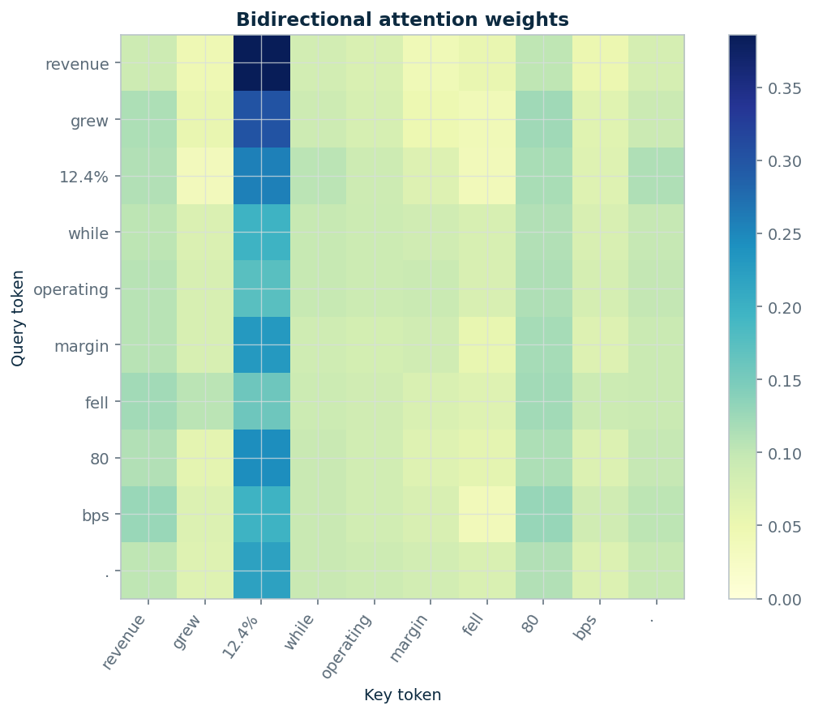
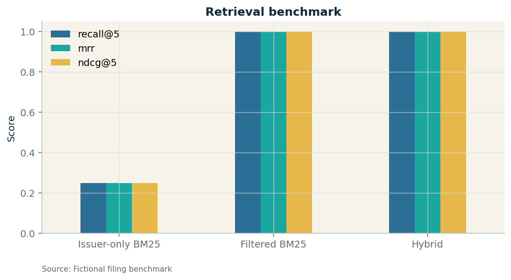
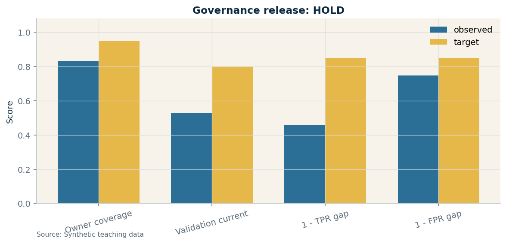
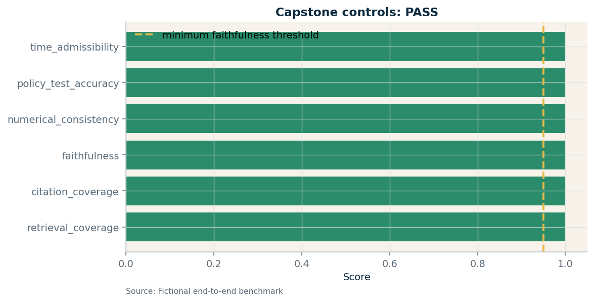

<p align="center">
  
</p>

<p align="center">
  <a href="https://github.com/PacktPublishing/LLMs-in-Finance/actions/workflows/notebooks.yml">
    
  </a>
  
  
  
  
  <a href="LICENSE">
    
  </a>
</p>

# Large Language Models in Finance — Companion Notebook Suite

An executable, governed laboratory for *Large Language Models in Finance* by
Miquel Noguer i Alonso (Packt, 2026; ISBN 978-1-83702-453-7).

The repository contains **17 chapter-aligned core labs** and **one optional
external-system bridge**. It moves from tokenization and attention through
fine-tuning, point-in-time RAG, multi-agent systems, typed tools, preference
optimization, infrastructure, governance, backtesting, and an integrated
earnings-intelligence capstone.

<p align="center">
  <a href="https://colab.research.google.com/github/PacktPublishing/LLMs-in-Finance/blob/main/notebooks/00_start_here.ipynb">
    
  </a>
  &nbsp;
  <a href="notebooks/00_start_here.ipynb"><strong>View the executed first lab</strong></a>
  &nbsp;·&nbsp;
  <a href="docs/LEARNING_PATHS.md"><strong>Choose a learning path</strong></a>
</p>

<p align="center">
  
</p>

> **Edition integrity:** this is an additive educational layer. It does not
> alter or replace the book's immutable canonical companion release
> `B32413-v1.0.0`.
>
> **Current notebook release:** v1.1.0 preserves the independently verified
> v1.0.1 correction set and adds GitHub, Colab, optional-model, public-data,
> security, and deterministic packaging support. See the
> [changelog](CHANGELOG.md) and
> [rebuild provenance](audit_logs/REBUILD_PROVENANCE.md).

## Why this suite is different

- **Point-in-time by construction.** Evidence is filtered before corpus
  statistics, ranking, training, or prediction.
- **Models propose; controls decide.** Numerical checks, schemas, authority,
  idempotency, audit links, and human review remain separate.
- **Negative results stay visible.** Calibration and governance labs retain
  genuine `HOLD` outcomes when release criteria fail.
- **Every default run is inspectable.** No credentials, provider calls, model
  downloads, live broker, client advice, or proprietary data.
- **The release reproduces itself.** Fixtures, notebooks, previews, manifests,
  tests, and the ZIP are rebuilt and verified in CI and again after extraction.
- **External systems are explicit.** Notebook 17 offers a real local model and
  public SEC adapter, both disabled by default and unable to bypass review.

## Choose your route

| Route | Time | Sequence |
|---|---:|---|
| Visual tour | 15 min | 00 → inspect 04 → final scorecard in 16 |
| Fast governed-LLM path | 2 hours | 00 → 04 → 06 → 16 |
| Practitioner day | 5–6 hours | 00 → 01 → 02 → 04 → 05 → 06 → 11 → 16 |
| Full book companion | 9–11 hours | 00–16 in order |
| External-system extension | +45 min | 17 after completing 04 and 06 |

Detailed quantitative-research, governance, engineering, and instructor routes
are in [`docs/LEARNING_PATHS.md`](docs/LEARNING_PATHS.md).

## Quick start

### GitHub or Colab

Every notebook is committed with verified outputs for immediate GitHub viewing
and contains its own **Open in Colab** button. In Colab, the generated bootstrap
cell clones this official repository and installs the core package; locally and
in CI that cell is inert.

### Local

```bash
git clone https://github.com/PacktPublishing/LLMs-in-Finance.git
cd LLMs-in-Finance
python -m venv .venv
source .venv/bin/activate        # Windows: .venv\Scripts\activate
python -m pip install -e ".[notebooks]"
jupyter lab
```

Open [`notebooks/00_start_here.ipynb`](notebooks/00_start_here.ipynb).

## The governing architecture


The model never authorizes itself. Material claims carry evidence identifiers,
and material actions require deterministic controls and named human
responsibility.

## Selected outputs

<table>
  <tr>
    <td width="50%"></td>
    <td width="50%"></td>
  </tr>
  <tr>
    <td align="center"><strong>Attention from first principles</strong></td>
    <td align="center"><strong>Point-in-time retrieval evaluation</strong></td>
  </tr>
  <tr>
    <td></td>
    <td></td>
  </tr>
  <tr>
    <td align="center"><strong>Governance with honest holds</strong></td>
    <td align="center"><strong>Integrated capstone scorecard</strong></td>
  </tr>
</table>

## Notebook curriculum

| Lab | Book chapter | What you build | Run |
|---|---:|---|---|
| [00 · Start here](notebooks/00_start_here.ipynb) | Orientation | Minimum governed evidence-to-review contract | [Colab](https://colab.research.google.com/github/PacktPublishing/LLMs-in-Finance/blob/main/notebooks/00_start_here.ipynb) |
| [01 · Earnings-call assistant](notebooks/01_earnings_call_assistant.ipynb) | 1 | Extraction, n-grams, honest tone baseline, cited draft | [Colab](https://colab.research.google.com/github/PacktPublishing/LLMs-in-Finance/blob/main/notebooks/01_earnings_call_assistant.ipynb) |
| [02 · Transformer mechanics](notebooks/02_transformer_mechanics.ipynb) | 2 | NumPy attention and multi-head projection from first principles | [Colab](https://colab.research.google.com/github/PacktPublishing/LLMs-in-Finance/blob/main/notebooks/02_transformer_mechanics.ipynb) |
| [03 · Fine-tuning and calibration](notebooks/03_fine_tuning_and_calibration.ipynb) | 3 | Chronological classifier and calibration audit | [Colab](https://colab.research.google.com/github/PacktPublishing/LLMs-in-Finance/blob/main/notebooks/03_fine_tuning_and_calibration.ipynb) |
| [04 · Point-in-time RAG](notebooks/04_point_in_time_rag.ipynb) | 4 | Temporally admissible hybrid retrieval and claim support | [Colab](https://colab.research.google.com/github/PacktPublishing/LLMs-in-Finance/blob/main/notebooks/04_point_in_time_rag.ipynb) |
| [05 · Governed multi-agent research](notebooks/05_governed_multi_agent_research.ipynb) | 5 | Supervisor, specialists, traces, and adversarial cases | [Colab](https://colab.research.google.com/github/PacktPublishing/LLMs-in-Finance/blob/main/notebooks/05_governed_multi_agent_research.ipynb) |
| [06 · Hardened tool invocation](notebooks/06_hardened_tool_invocation.ipynb) | 6 | Schemas, permissions, request idempotency, and audit chain | [Colab](https://colab.research.google.com/github/PacktPublishing/LLMs-in-Finance/blob/main/notebooks/06_hardened_tool_invocation.ipynb) |
| [07 · Finance applications](notebooks/07_finance_applications.ipynb) | 7 | Front-, middle-, and back-office mini cases | [Colab](https://colab.research.google.com/github/PacktPublishing/LLMs-in-Finance/blob/main/notebooks/07_finance_applications.ipynb) |
| [08 · Documents and suitability](notebooks/08_document_intelligence_and_suitability.ipynb) | 8 | Covenant extraction, calculation, and advisory controls | [Colab](https://colab.research.google.com/github/PacktPublishing/LLMs-in-Finance/blob/main/notebooks/08_document_intelligence_and_suitability.ipynb) |
| [09 · Preference optimization](notebooks/09_preference_optimization.ipynb) | 9 | Discrete PPO, GRPO, DPO, and KL control | [Colab](https://colab.research.google.com/github/PacktPublishing/LLMs-in-Finance/blob/main/notebooks/09_preference_optimization.ipynb) |
| [10 · Inference and capacity](notebooks/10_inference_and_capacity.ipynb) | 10 | Quality–latency–cost choice and queue stress | [Colab](https://colab.research.google.com/github/PacktPublishing/LLMs-in-Finance/blob/main/notebooks/10_inference_and_capacity.ipynb) |
| [11 · Governance control tower](notebooks/11_governance_control_tower.ipynb) | 11 | Inventory, group audit, remediation, and release hold | [Colab](https://colab.research.google.com/github/PacktPublishing/LLMs-in-Finance/blob/main/notebooks/11_governance_control_tower.ipynb) |
| [12 · Evidence matrix](notebooks/12_evidence_matrix_and_benchmarks.ipynb) | 12 | Uncertainty- and maturity-aware evidence comparison | [Colab](https://colab.research.google.com/github/PacktPublishing/LLMs-in-Finance/blob/main/notebooks/12_evidence_matrix_and_benchmarks.ipynb) |
| [13 · Point-in-time forecasting](notebooks/13_point_in_time_forecasting.ipynb) | 13 | Clean versus contaminated signal experiment | [Colab](https://colab.research.google.com/github/PacktPublishing/LLMs-in-Finance/blob/main/notebooks/13_point_in_time_forecasting.ipynb) |
| [14 · Bounded autonomous agents](notebooks/14_bounded_autonomous_agents.ipynb) | 14 | Paper-only intent gate, herding, and circuit breaker | [Colab](https://colab.research.google.com/github/PacktPublishing/LLMs-in-Finance/blob/main/notebooks/14_bounded_autonomous_agents.ipynb) |
| [15 · Technical foundations](notebooks/15_technical_foundations.ipynb) | 15 | Executable acceptance tests for cross-book invariants | [Colab](https://colab.research.google.com/github/PacktPublishing/LLMs-in-Finance/blob/main/notebooks/15_technical_foundations.ipynb) |
| [16 · Capstone](notebooks/16_capstone_earnings_intelligence.ipynb) | Integrated | Governed earnings-intelligence system and scorecard | [Colab](https://colab.research.google.com/github/PacktPublishing/LLMs-in-Finance/blob/main/notebooks/16_capstone_earnings_intelligence.ipynb) |
| [17 · Optional model + SEC](notebooks/17_optional_real_model_and_sec.ipynb) | Extension | Real local model and public-data adapters behind explicit gates | [Colab](https://colab.research.google.com/github/PacktPublishing/LLMs-in-Finance/blob/main/notebooks/17_optional_real_model_and_sec.ipynb) |

## Optional real model and public data

Notebook 17 provides a working integration path for a compact open-weight
Transformers model and SEC EDGAR Company Facts. The release executes the
adapter logic offline; actual downloads and HTTP requests require explicit
environment gates.

```bash
python -m pip install -r requirements-extensions.txt
python -m pip install --no-deps -e .
FINLLM_RUN_REAL_MODEL=1 jupyter lab
```

Read [`docs/OPTIONAL_EXTENSIONS.md`](docs/OPTIONAL_EXTENSIONS.md) before
enabling a model or public-data request.

## Reproduce and verify

Install the exact core release environment on Python 3.11 or 3.12:

```bash
python -m pip install -r requirements-lock.txt
python -m pip install -r requirements-dev.txt
python -m pip install --no-deps -e .
make reproduce
```

For the complete pre-publication gate:

```bash
make release
```

That command adds linting, creates a deterministic release ZIP, rejects unsafe
or nested archive members, extracts it in a temporary directory, and repeats
the full build. The release fails if any tracked byte changes.

Exact notebook, figure, test, and file hashes are recorded in
[`RELEASE_MANIFEST.json`](RELEASE_MANIFEST.json). Maintainers should follow
[`docs/PUBLISHING.md`](docs/PUBLISHING.md).

## Repository structure

```text
.
├── notebooks/             # Generated and executed .ipynb files
├── notebook_sources/      # Review-friendly percent-format sources
├── src/finllm_lab/        # Typed contracts, metrics, controls, integrations
├── data/                  # Deterministic fictional fixtures and data cards
├── docs/                  # Learning, extension, and publication guides
├── model_cards/           # Template and honest optional-model integration card
├── prompt_registry/       # Versioned prompt contract
├── audit_logs/            # Audit guidance and trusted rebuild provenance
├── assets/                # Banner, notebook previews, GIF, social image
├── scripts/               # Build, execution, verification, packaging
├── tests/                 # Credential-free regression and release tests
└── .github/               # CI, CodeQL, releases, Dependabot, issue templates
```

## Data, safety, and scope

The committed fixtures represent no real company, filing, transaction, client,
contract, price history, or investment result. `ACME`, `NIMB`, `ORBT`, and
`VELA` are fictional. Read [`data/README.md`](data/README.md) and the individual
data cards before extending a lab.

These notebooks are educational reference implementations—not investment
advice, legal guidance, production controls, or a live-trading system.
Production use requires licensed data, security and privacy review,
independent validation, monitoring, change management, and accountable human
owners. See [`SECURITY.md`](SECURITY.md).

## Contributing, citation, and license

Contributions are welcome when they preserve the temporal, governance,
reproducibility, and safety contracts in
[`CONTRIBUTING.md`](CONTRIBUTING.md).

```text
Noguer i Alonso, M. (2026).
Large Language Models in Finance.
Packt Publishing. ISBN 978-1-83702-453-7.
```

Machine-readable metadata are in [`CITATION.cff`](CITATION.cff). Code and
notebook materials are available under the [MIT License](LICENSE), matching the
official Packt repository.
